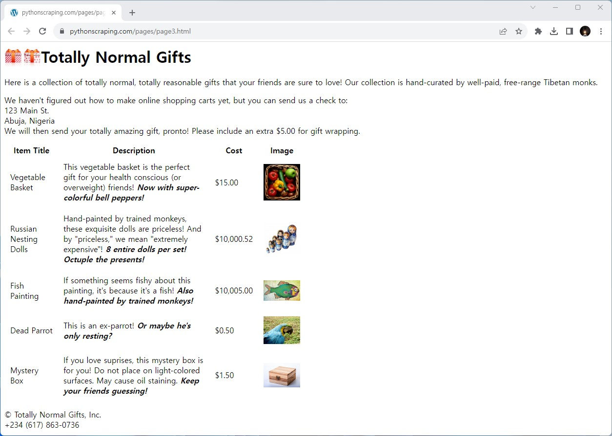

# parse_img_ids

- [이 웹문서](http://www.pythonscraping.com/pages/page3.html)를 파싱해서, 이미지 url을 추출해보자!
- 정규표현식 & BeautifulSoup을 활용

../img/gifts/img1.jpg  
../img/gifts/img2.jpg  
../img/gifts/img3.jpg  
../img/gifts/img4.jpg  
../img/gifts/img6.jpg  
5개의 이미지의 고유한 정보를 추출해내면 된다(id).